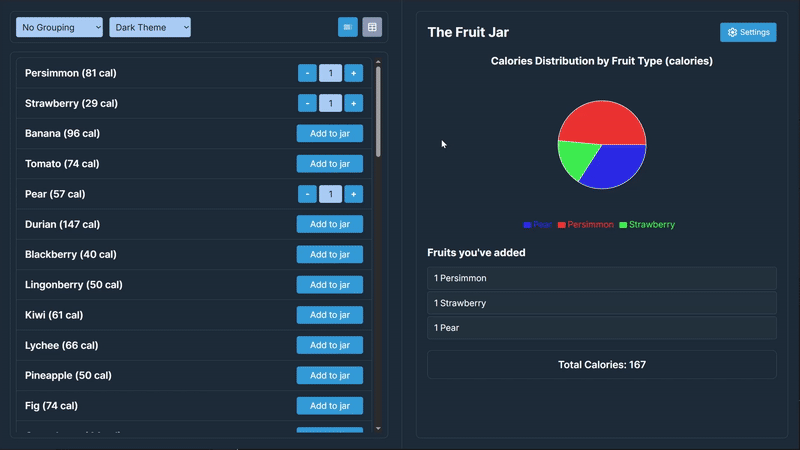
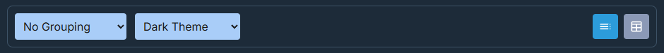
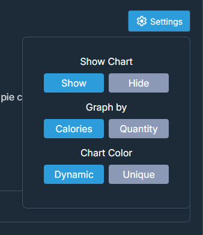

# fruit-app

Hello! This is my implementation of the Take Home exercise!

The deployed website can be visited here:
[fruit-app](https://kaitosugimura.github.io/fruit-app/)

## Cors error

To combat the CORS error, I set up a proxy server that calls the API from the proxy server instead.

You can see the proxy server working by going here:
[proxy server](https://fruit-app-proxy-server.onrender.com/proxy)

See [./src/server.ts](https://github.com/KaitoSugimura/fruit-app/blob/main/src/server.ts) for the server code

## Assumptions

Due to the limited time, I assumed the website would only be viewed on a Desktop/Laptop computer.
The website is still responsive to a degree, but will most likely not look good on a mobile device.
In a real environment, theres a few things that will need to be adjusted to fit those screens.

## Website functionality

Like in the image above, you can click and drag the middle line to change the width of the left and right panels.

The image above shows the navigation bar on the left side of the screen. From left to right, here's what each one does:

- **First Drop Down:** Pick how you want to group the fruits.
- **Second Drop Down:** Pick your color theme (Dark Theme recommended!).
- **First Button:** Shows the fruits as a list.
- **Second Button:** Shows the fruits as a table.
   
   

The image above shows the settings panel that pops up when you click the "Settings" button. Here's what each row does:

- **Show Chart:** Toggle the pie chart on or off.
- **Graph by:** Choose whether to graph by total calories (quantity × calories per fruit) or just by quantity.
- **Chart Color:** Dynamic gives you a nice spread of colors that adjusts as you add more fruit types. Unique gives each fruit its own permanent color that won't change.
